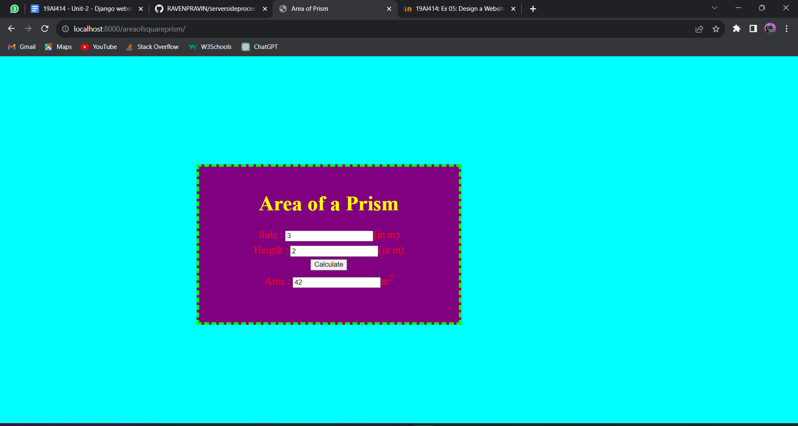

# Design a Website for Server Side Processing

## AIM:
To design a website to perform mathematical calculations in server side.

## DESIGN STEPS:

### Step 1:
First fork the given repository link and then copy your code.
### Step 2:
open visual stuido and create a folder and then clone the copied link using 'git clone [your link ]' and then activate Django.
### Step 3:
open the folder and then inside the repository folder create myproj folder using 'django-admin startproject myproj' command. And then open myproj folder inside the myproj folder we can create a app folder called 'myapp' using 'python manage.py startapp [your app name]' command .
### Step 4:
open 'settings.py' inside the myproj folder and make some changes. And then create a folder called 'templates' and then inside the templates create another folder (your app folder) named 'myapp'.
### Step 5:
Inside the myapp folder create 2 html files named 'math.html' , 'result.html' and then paste the codes that are given below. And then make the changes in 'url.py' and 'views.py'.Save all files and then run the code using 'python manage.py runserver [port number]'
### Step 6:
Publish the website in the given URL.
## PROGRAM :
```python

#views.py
from django.shortcuts import render
from django.template  import loader
from django.shortcuts import render


def prismarea(request):
    context={}
    context['area'] = "0"
    context['s'] = "0"
    context['b'] = "0"
    if request.method == 'POST':
        print("POST method is used")
        s = request.POST.get('side','0')
        h = request.POST.get('height','0')
        print('request=',request)
        print('side=',s)
        print('height=',h)
        area = 2*int(s) **2+4*int(s)*int(h)
        context['area'] = area
        context['s'] = s
        context['h'] = h
        print('Area=',area)
    return render(request,'myapp/math.html',context)


#math.html
<html>
<head>
<meta charset='utf-8'>
<meta http-equiv='X-UA-Compatible' content='IE=edge'>
<title>Area of Prism</title>
<meta name='viewport' content='width=device-width, initial-scale=1'>
<style type="text/css">
body 
{
background-color:cyan;
}
.edge {
width: 1080px;
margin-left: auto;
margin-right: auto;
padding-top: 200px;
padding-left: 300px;
}
.box {
display:block;
border: Thick dashed lime;
width: 500px;
min-height: 300px;
font-size: 20px;
background-color: purple;
}
.formelt{
color: Red;
text-align: center;
margin-top: 5px;
margin-bottom: 5px;
}
h1
{
color: yellow;
text-align: center;
padding-top: 20px;
}
</style>
</head>
<body>
<div class="edge">
<div class="box">
<h1>Area of a Prism</h1>
<form method="POST">

<div class="formelt">
Side   :   <input type="text" name="side" value="{{s}}"></input>(in m)<br/>
</div>
<div class="formelt">
Heigth : <input type="text" name="height" value="{{h}}"></input>(in m)<br/>
</div>
<div class="formelt">
<input type="submit" value="Calculate"></input><br/>
</div>
<div class="formelt">
Area : <input type="text" name="area" value="{{area}}"></input>m<sup>2</sup><br/>
</div>
</form>
</div>
</div>
</body>
</html>
#result.html
<!DOCTYPE html>
<html>
    <head>
        <title>SEC demo on server processing result</title>
    </head>
    <body>
        The result is {{result}}
    </body>
</html>


```
## OUTPUT:

### Home Page:



## Result:
The program area of prism is excuted sucessfully
